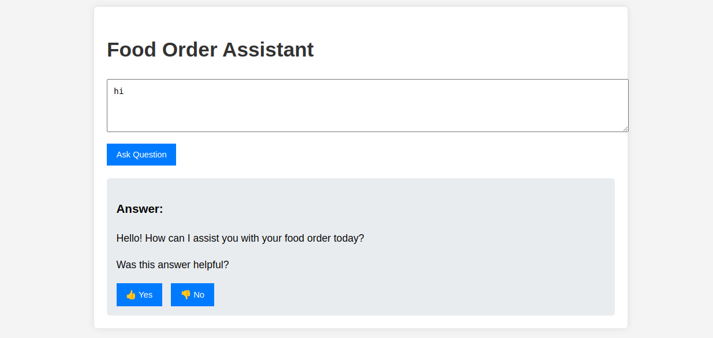
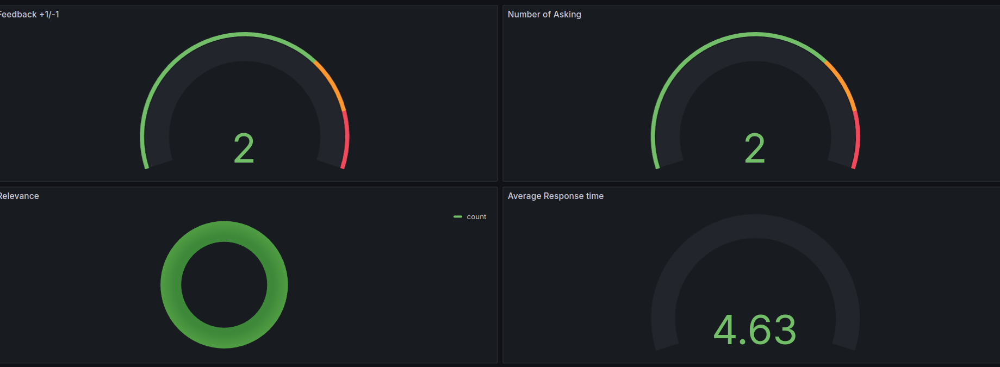
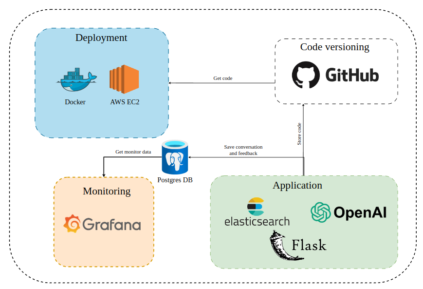

# Food Order Assistant

<p align="center">
  
</p>

## Table of Contents
1. [Problem Description](#problem-description)
2. [Technologies](#technologies)
3. [Dataset](#dataset)
4. [Reproducibility](#reproducibility)
5. [Using the application](#using-the-application)
6. [Monitoring](#monitoring)
7. [Deployment](#deployment)
8. [Experiments](#reproducibility)
9. [Code](#code)

## Problem Description

The Food Order Assistant is an AI-powered application designed to streamline and enhance the food ordering process. It leverages advanced natural language processing and retrieval-augmented generation (RAG) to understand user preferences, provide personalized menu recommendations, and assist with order placement.

Our solution addresses common pain points in food ordering, such as:
- Difficulty in choosing from extensive menus
- Lack of personalized recommendations
- Confusion about ingredient details or dietary restrictions
- Time-consuming order placement process

By providing an intuitive, conversational interface, our Food Order Assistant makes the ordering experience more efficient and enjoyable for users while potentially increasing order accuracy and customer satisfaction for restaurants.

## Technologies

- Python 3.11
- Docker and Docker Compose for containerization
- [Elasticsearch](https://www.elastic.co/) for full-text search
- Flask as the API interface
- Grafana for monitoring and PostgreSQL as the backend for it
- OpenAI as an LLM

## Dataset

The dataset used in this project contains information about
various exercises, including:

- **Food Name**: The name of the food dish (e.g., "Margherita Pizza").
- **Cuisine**: The cultural or regional origin of the dish (e.g., "Italian").
- **Type**: The dish category (e.g., "Main Dish," "Appetizer").
- **Ingredients**: Key ingredients used in the dish.
- **Serving**: The portion size (e.g., "1 plate," "1 bowl").
- **Price**: The cost of the dish in dollars (e.g., "$12.00").
- **Calories**: The calorie content of a serving (e.g., "250 kcal").

The dataset was generated using ChatGPT and contains 100 records. It serves as the foundation for the Food Order Assistant

You can find the data in [`data/data.csv`](data/data.csv).

## Reproducibility

To run the Food Order Assistant locally:

### 1. Clone repository: 
```bash
git clone https://github.com/quzanh1130/food-order-assistant.git
cd food-order-assistant
```
### 2. Preparation

Since we use OpenAI, you need to provide the API key:

COPY and PASTE it to .env file

For dependency management, we use pipenv, so you need to install it:

```bash
sudo apt install pipenv
```

Once installed, you can install the app dependencies:

```bash
pipenv install --dev
```

### 3. Database configuration

Before the application starts for the first time, the database
needs to be initialized.

First, run `postgres`:

```bash
docker-compose up postgres
```

Then run the [`db_prep.py`](food_order_assistant/db_prep.py) script:

```bash
pipenv shell

cd food_order_assistant

export POSTGRES_HOST=localhost
python db_prep.py
```

To check the content of the database, use `pgcli` (already
installed with pipenv):

```bash
pipenv run pgcli -h localhost -U quzanh1130 -d food_order_assistant -W
```

You can view the schema using the `\d` command:

```sql
\d conversations;
```

And select from this table:

```sql
select * from conversations;
```

### 4. Running with Docker-Compose

The easiest way to run the application is with `docker-compose`:

```bash
docker-compose up
```

### 5. Time configuration

When inserting logs into the database, ensure the timestamps are
correct. Otherwise, they won't be displayed accurately in Grafana.

When you start the application, you will see the following in
your logs:

```
Database timezone: Etc/UTC
Database current time (UTC): 2024-08-24 06:43:12.169624+00:00
Database current time (Europe/Berlin): 2024-08-24 08:43:12.169624+02:00
Python current time: 2024-08-24 08:43:12.170246+02:00
Inserted time (UTC): 2024-08-24 06:43:12.170246+00:00
Inserted time (Europe/Berlin): 2024-08-24 08:43:12.170246+02:00
Selected time (UTC): 2024-08-24 06:43:12.170246+00:00
Selected time (Europe/Berlin): 2024-08-24 08:43:12.170246+02:00
```

Make sure the time is correct.

You can change the timezone by replacing `TZ` in `.env`.

On some systems, specifically WSL, the clock in Docker may get
out of sync with the host system. You can check that by running:

```bash
docker run ubuntu date
```

If the time doesn't match yours, you need to sync the clock:

```bash
wsl

sudo apt install ntpdate
sudo ntpdate time.windows.com
```

Note that the time is in UTC.

After that, start the application (and the database) again.


## Using the application

When the application is running, we can start using it.

### Using simple UI

We build a simple UI using HTML|CSS|Javascript

You can open it at [localhost:5000](https://localhost:5000)

<p align="center">
  
</p>


### CLI

We built an interactive CLI application using
[questionary](https://questionary.readthedocs.io/en/stable/).

To start it, run:

```bash
pipenv run python cli.py
```

You can also make it randomly select a question from
[our ground truth dataset](data/ground-truth-retrieval.csv):

```bash
pipenv run python cli.py --random
```

### Using `requests`

When the application is running, you can use
[requests](https://requests.readthedocs.io/en/latest/)
to send questions—use [test.py](test.py) for testing it:

```bash
pipenv run python test.py
```

It will pick a random question from the ground truth dataset
and send it to the app.

### CURL

You can also use `curl` for interacting with the API:

```bash
URL=http://localhost:5000
QUESTION="What are the main ingredients in the Lobster Roll?"
DATA='{
    "question": "'${QUESTION}'"
}'

curl -X POST \
    -H "Content-Type: application/json" \
    -d "${DATA}" \
    ${URL}/question
```

You will see something like the following in the response:

```json
{
    "answer": "The main ingredients in the Lobster Roll are Lobster, Butter, and a Hot Dog Bun.",
    "conversation_id": "0eedac38-a25e-4d74-bd33-d30566dd051d",
    "question": "What are the main ingredients in the Lobster Roll?"
}
```

Sending feedback:

```bash
ID="0eedac38-a25e-4d74-bd33-d30566dd051d"
URL=http://localhost:5000
FEEDBACK_DATA='{
    "conversation_id": "'${ID}'",
    "feedback": 1
}'

curl -X POST \
    -H "Content-Type: application/json" \
    -d "${FEEDBACK_DATA}" \
    ${URL}/feedback
```

After sending it, you'll receive the acknowledgement:

```json
{
    "message": "Feedback received for conversation 0eedac38-a25e-4d74-bd33-d30566dd051d: 1"
}
```
## Monitoring

We using Grafana for monitoring the system.

You can open the dashboard at [localhost:3000](https://localhost:3000)

- Login: "admin"
- Password: "admin"

### Dashboards

<p align="center">
  
</p>

The monitoring dashboard contains several panels:

1. **Last 5 Conversations (Table):** Displays a table showing the five most recent conversations, including details such as the question, answer, relevance, and timestamp. This panel helps monitor recent interactions with users.
2. **Feedback +1/-1 (Pie Chart):** A pie chart that visualizes the feedback from users, showing the count of positive (thumbs up) and negative (thumbs down) feedback received. This panel helps track user satisfaction.
3. **Relevance (Gauge):** A gauge chart representing the relevance of the responses provided during conversations. The chart categorizes relevance and indicates thresholds using different colors to highlight varying levels of response quality.
4. **OpenAI Cost (Time Series):** A time series line chart depicting the cost associated with OpenAI usage over time. This panel helps monitor and analyze the expenditure linked to the AI model's usage.
5. **Tokens (Time Series):** Another time series chart that tracks the number of tokens used in conversations over time. This helps to understand the usage patterns and the volume of data processed.
6. **Average Response Time (Time Series):** A time series chart showing the response time of conversations over time. This panel is useful for identifying performance issues and ensuring the system's responsiveness.

### Setting up Grafana

All Grafana configurations are in the [`grafana`](grafana/) folder:

- [`init.py`](grafana/init.py) - for initializing the datasource and the dashboard.
- [`dashboard.json`](grafana/dashboard.json) - the actual dashboard (taken from LLM Zoomcamp without changes).

To initialize the dashboard, first ensure Grafana is
running (it starts automatically when you do `docker-compose up`).

Then run:

```bash
pipenv shell

cd grafana

# make sure the POSTGRES_HOST variable is not overwritten 
env | grep POSTGRES_HOST

python init.py
```

Then go to [localhost:3000](http://localhost:3000):

- Login: "admin"
- Password: "admin"

When prompted, keep "admin" as the new password.

## Deployment

We using AWS EC2 to deploy our project.

<p align="center">
  
</p>

Follow the Youtube link below to create AWS EC2 and run your code

[Hosting a Docker Container on AWS EC2 Free Tier in under 12 minutes](https://www.youtube.com/watch?v=qNIniDftAcU)

We using storage to `20GB` and medium instance

And remember edit security group for inbound rule to open Port

[Amazon EC2 instance public IP accessible from outside |add security group EC2 IP](https://www.youtube.com/watch?v=ukdTGVVcqE0)


``` bash
sudo yum update -y
sudo yum install -y docker
sudo usermod -a -G docker ec2-user
sudo yum install git -y

sudo curl -L https://github.com/docker/compose/releases/latest/download/docker-compose-$(uname -s)-$(uname -m) -o /usr/local/bin/docker-compose
sudo chmod +x /usr/local/bin/docker-compose

docker-compose version ## >> Docker Compose version v2.29.7

pwd ## >> /home/ec2-user
mkdir downloads
cd downloads

sudo yum install python311
python3 --version

curl -O https://bootstrap.pypa.io/get-pip.py
python3 get-pip.py --user

## >> Python 3.11.0

git clone https://github.com/quzanh1130/food_order_assistant.git
cd food_order_assistant

vim .env_template
# > PASTE YOUR OPEN API KEY
# > esc -> :wq
mv .env_template .env

sudo docker-compose  up --build

## Conect to a new terminal
pip install pipenv

cd food_order_assistant
pipenv install

pipenv shell
python3 db_prep.py
```

After that you can open application

1. Application - `https://<public ip v4>:5000`
2. Grafana - `https://<public ip v4>:3000` (remmember set up rule for this port not access anywhere)

## Experiments

For experiments, we use Jupyter notebooks.
They are in the [`notebooks`](notebooks/) folder.

To start Jupyter, run:

```bash
cd notebooks
pipenv run jupyter notebook
```

We have the following notebooks:

- [`rag-test.ipynb`](notebooks/rag_test.ipynb): The RAG flow and evaluating the system.
- [`evaluation-data-generation.ipynb`](notebooks/evaluation-data-generation.ipynb): Generating the ground truth dataset for retrieval evaluation.

### Retrieval evaluation

**1. The basic approach - using `minsearch` without any boosting - gave the following metrics:**

- Hit rate: 94,2%
- MRR: 88,2%

The improved version (with tuned boosting):

- Hit rate: 94,6%
- MRR: 89,2%

The best boosting parameters:

```python
boost = {
      'name': 1.65,
      'cuisine': 1.84,
      'type': 1.63,
      'ingredients': 2.87,
      'serving': 0.95,
      'price': 1.37,
      'calories': 0.23
}
```

**2. The another approach using `Elastic search + knn`:**

- Hit rate: 94,6%
- MRR: 91,4%

### RAG flow evaluation

We used the LLM-as-a-Judge metric to evaluate the quality
of our RAG flow.

For `gpt-4o-mini`, in a sample with 100 records, we had:

- 92 (92%) `RELEVANT`
- 7 (7%) `PARTLY_RELEVANT`
- 1 (1%) `NON_RELEVANT`

We also tested `gpt-4o`:

- 93 (93%) `RELEVANT`
- 7 (7%) `PARTLY_RELEVANT`
- 0 (0%) `NON_RELEVANT`

The difference is minimal, so we opted for `gpt-4o-mini`.

## Code

The code for the application is in the [`food_order_assistant`](food_order_assistant/) folder:

- [`app.py`](food_order_assistant/app.py) - the Flask API, the main entrypoint to the application
- [`rag.py`](food_order_assistant/rag.py) - the main RAG logic for building the retrieving the data and building the prompt
- [`ingest.py`](food_order_assistant/ingest.py) - loading the data into the knowledge base
- [`db.py`](food_order_assistant/db.py) - the logic for logging the requests and responses to postgres
- [`db_prep.py`](food_order_assistant/db_prep.py) - the script for initializing the database
- [`static`](food_order_assistant/static/) - the folder contain ui code

We also have some code in the project root directory:

- [`test.py`](test.py) - select a random question for testing
- [`cli.py`](cli.py) - interactive CLI for the APP

### Interface

We use Flask for serving the application as an API.

Refer to the ["Using the Application" section](#using-the-application)
for examples on how to interact with the application.

### Ingestion

The ingestion script is in [`ingest.py`](food_order_assistant/ingest.py).

We using combine to db_prep.py to intial database + index data to elastic search.

Remember run `db_prep.py` for set up postgres and elasticsearch